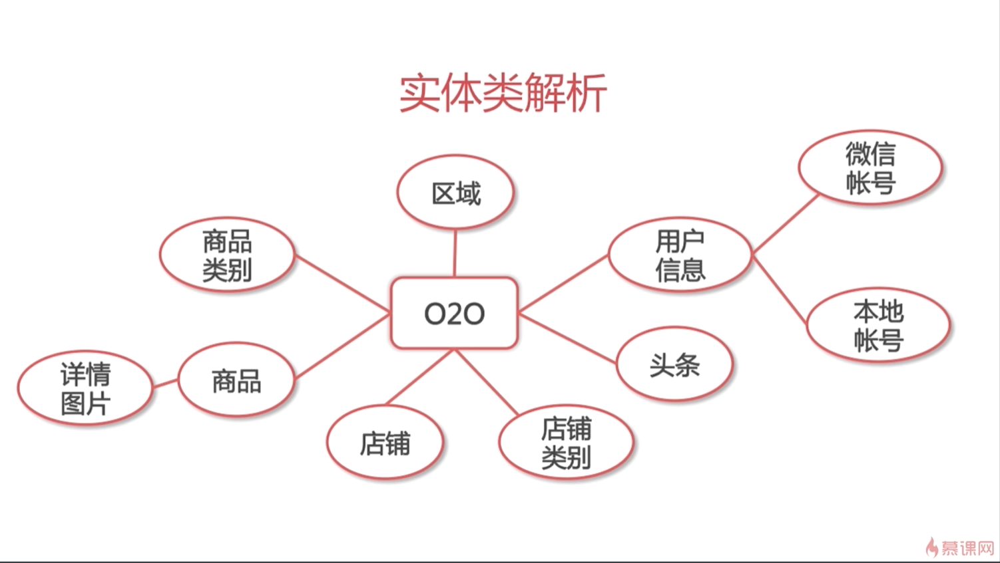
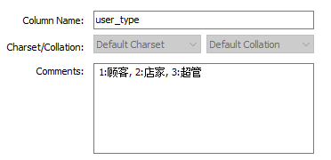

# DB设计

总设计图：



除了在MySQL中添加表格外，还要在package中添加对应实体的类。以用户信息为例：

### tb_person_info

``` mysql
use o2o;

create table tb_person_info (
	user_id int(10) not null auto_increment,
    name varchar(32) default null,
    profile_img varchar(1024) default null,
    email_img varchar(1024) default null,
    gender varchar(2) default null,
    enable_status int(2) not null default 0 comment "0:禁用, 1:可用",
    user_type int(2) not null default 1 comment "1:顾客, 2:店家, 3:超管",
    create_time datetime default null,
    last_edit_time datetime default null,
    primary key(user_id)
) engine = innodb auto_increment = 1 default charset = utf8mb4;
```

comment相当于备注，在创建后信息是会一直保留的，并且可以查看到，如下图。utf8mb4相比utf8(utf8mb3)扩充了更多字符，如emoji表情等。



### Personinfo.java

``` java
package com.xinyuan.o2o.entity;

import java.util.Date;

public class PersonInfo {

	private Long userId;
	
	private String name;
	
	private String profileImg;
	
	private String email;
	
	private String gender;
	
	private Integer enableStatus;
	
	private Integer userType;	// 1.顾客 2.店家 3.超管
	
	private Date createTime;
	
	private Date lastEditTime;

	// ... 这部分可以通过eclipse自动构建setter和getter方法。
}

```

这里用Integer而不是int，主要是考虑到数据库方面可能有null值，这里用包装类的话也可以表示null值，保持一致。

另外，这里出现了表与表之间通过主外键关联的情况，应该如何设置？

首先，在实体类中包含关联类的对象：

### LocalAuth.java

``` java
private PersonInfo personInfo;
```

然后对应表中添加关联属性并引入外键约束：

``` mysql
constraint fk_localauth_profile foreign key(user_id) references tb_person_info(user_id)
```

另外补充一下唯一键（索引）的两种设置方式：

``` mysql
unique key uk_local_profile (username) # 在create时添加

alter table tb_wechat_auth modify open_id varchar(512) not null;
alter table tb_wechat_auth add unique index(open_id); # create完成后修改
```

最后说一下可能遇到的坑：

### MySQL提示key的大小不能超过3072字节

原因是一开始设置open_id为varchar(1024)，字符集为utf8mb4，那么MySQL会按最大标准来分配内存，也就是1024 * 4 = 4096字节。很明显超标了，所以要么改字符集为utf8(mb3)，要么将varchar改小成512等。


