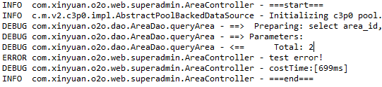

# Logback配置

在resources目录下添加logback.xml

``` xml
<?xml version="1.0" encoding="UTF-8"?>
<configuration scan="true" scanPeriod="60 seconds" debug="false">
	<!-- 定义参数常量 -->
	<!-- TRACE<DEBUG<INFO<WARN<ERROR -->
	<!-- logger.trace("msg") logger.debug... -->
	<property name="log.level" value="debug" />
	<property name="log.maxHistory" value="30" />
	<property name="log.filePath" value="${catalina.base}/logs/webapps" />
	<property name="log.pattern"
		value="%d{yyyy-MM-dd HH:mm:ss.SSS} [%thread] %-5level %logger{50} - %msg%n" />
	<!-- 控制台设置 -->
	<appender name="consoleAppender" class="ch.qos.logback.core.ConsoleAppender">
		<encoder>
			<pattern>${log.pattern}</pattern>
		</encoder>
	</appender>
	<!-- DEBUG -->
	<appender name="debugAppender" class="ch.qos.logback.core.rolling.RollingFileAppender">
		<!-- 文件路径 -->
		<file>${log.filePath}/debug.log</file>
		<rollingPolicy class="ch.qos.logback.core.rolling.TimeBasedRollingPolicy">
			<!-- 文件名称 -->
			<fileNamePattern>${log.filePath}/debug/debug.%d{yyyy-MM-dd}.log.gz
			</fileNamePattern>
			<!-- 文件最大保存历史数量 -->
			<maxHistory>${log.maxHistory}</maxHistory>
		</rollingPolicy>
		<encoder>
			<pattern>${log.pattern}</pattern>
		</encoder>
		<filter class="ch.qos.logback.classic.filter.LevelFilter">
			<level>DEBUG</level>
			<onMatch>ACCEPT</onMatch>
			<onMismatch>DENY</onMismatch>
		</filter>
	</appender>
	<!-- INFO -->
	<appender name="infoAppender" class="ch.qos.logback.core.rolling.RollingFileAppender">
		<!-- 文件路径 -->
		<file>${log.filePath}/info.log</file>
		<rollingPolicy class="ch.qos.logback.core.rolling.TimeBasedRollingPolicy">
			<!-- 文件名称 -->
			<fileNamePattern>${log.filePath}/info/info.%d{yyyy-MM-dd}.log.gz
			</fileNamePattern>
			<!-- 文件最大保存历史数量 -->
			<maxHistory>${log.maxHistory}</maxHistory>
		</rollingPolicy>
		<encoder>
			<pattern>${log.pattern}</pattern>
		</encoder>
		<filter class="ch.qos.logback.classic.filter.LevelFilter">
			<level>INFO</level>
			<onMatch>ACCEPT</onMatch>
			<onMismatch>DENY</onMismatch>
		</filter>
	</appender>
	<!-- ERROR -->
	<appender name="errorAppender" class="ch.qos.logback.core.rolling.RollingFileAppender">
		<!-- 文件路径 -->
		<file>${log.filePath}/error.log</file>
		<rollingPolicy class="ch.qos.logback.core.rolling.TimeBasedRollingPolicy">
			<!-- 文件名称 -->
			<fileNamePattern>${log.filePath}/error/error.%d{yyyy-MM-dd}.log.gz
			</fileNamePattern>
			<!-- 文件最大保存历史数量 -->
			<maxHistory>${log.maxHistory}</maxHistory>
		</rollingPolicy>
		<encoder>
			<pattern>${log.pattern}</pattern>
		</encoder>
		<filter class="ch.qos.logback.classic.filter.LevelFilter">
			<level>ERROR</level>
			<onMatch>ACCEPT</onMatch>
			<onMismatch>DENY</onMismatch>
		</filter>
	</appender>
	<logger name="com.xinyuan.o2o" level="${log.level}" additivity="true">
		<appender-ref ref="debugAppender"/>
		<appender-ref ref="infoAppender"/>
		<appender-ref ref="errorAppender"/>
	</logger>
	<root level="info">
		<appender-ref ref="consoleAppender"/>
	</root>
</configuration>
```

使用的时候一般在Service层或者Controller记录日志信息。要导入org.slf4j.Logger和org.slf4j.LoggerFactory这两个包并初始化logger。

``` java
Logger logger = LoggerFactory.getLogger(AreaController.class);
```

然后就可以在需要的地方插入语句：

``` java
logger.info("===start===");
// to do ...
logger.error("test error!");
long endTime = System.currentTimeMillis();
logger.debug("costTime:[{}ms]", endTime - startTime);
logger.info("===end===");
```

最后可以在控制台看到打印的信息，另外在tomcat根目录下指定的位置也能看到保存的.log文件。

