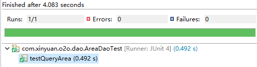
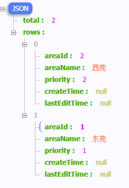

# SSM搭建

在配置SSM之前，还需要做一些准备工作。

添加所需的packages：


然后在pom.xml中添加所需的依赖，由于太多就不罗列了，大致可以分为以下几类：单元测试，日志，Spring，MyBatis，MySQL，还有一些工具类等等。

接着我们继续添加所需的配置文件：


### jdbc.properties

``` txt
jdbc.driver = com.mysql.jdbc.Driver
jdbc.url = jdbc:mysql://localhost:3306/o2o?useUnicode=true&characterEncoding=utf8
jdbc.username=root
jdbc.password=4012
```

这是一个通过jdbc连接MySQL的配置文件，里面是连接所需的参数。

### mybatis-config.xml

``` xml
<?xml version="1.0" encoding="UTF-8"?>
<!DOCTYPE configuration
  PUBLIC "-//mybatis.org//DTD Config 3.0//EN"
  "http://mybatis.org/dtd/mybatis-3-config.dtd">
<configuration>
	<!-- 配置全局属性 -->
	<settings>
		<!-- 使用jdbc的getGeneratedKeys获取数据库自增主键值 -->
		<setting name="useGeneratedKeys" value="true" />

		<!-- 使用列标签替换列别名 默认:true -->
		<setting name="useColumnLabel" value="true" />

		<!-- 开启驼峰命名转换:Table{create_time} -> Entity{createTime} -->
		<setting name="mapUnderscoreToCamelCase" value="true" />
	</settings>
</configuration>
```

配置了MyBatis的相关参数。

### spring-*.xml

``` xml
<?xml version="1.0" encoding="UTF-8"?>
<beans xmlns="http://www.springframework.org/schema/beans"
	xmlns:xsi="http://www.w3.org/2001/XMLSchema-instance" xmlns:context="http://www.springframework.org/schema/context"
	xsi:schemaLocation="http://www.springframework.org/schema/beans
    http://www.springframework.org/schema/beans/spring-beans.xsd
    http://www.springframework.org/schema/context
    http://www.springframework.org/schema/context/spring-context.xsd">
	<!-- 配置整合mybatis过程 -->
	<!-- 1.配置数据库相关参数properties的属性：${url} -->
	<context:property-placeholder location = "classpath:jdbc.properties"/>
	
	<!-- 2.数据库连接池 -->
	<bean id="dataSource"
		class="com.mchange.v2.c3p0.ComboPooledDataSource">
		<!-- 配置连接池属性 -->
		<property name = "driverClass" value = "${jdbc.driver}" />
		<property name = "jdbcUrl" value = "${jdbc.url}" />
		<property name = "user" value = "${jdbc.username}" />
		<property name = "password" value = "${jdbc.password}" />
		<!-- c3p0连接池的私有属性 -->
		<property name="maxPoolSize" value="30" />
		<property name="minPoolSize" value="10" />
		<property name="initialPoolSize" value="10"/> 
		<!-- 关闭连接后不自动commit -->
		<property name="autoCommitOnClose" value="false" />
		<!-- 获取连接超时时间 -->
		<property name="checkoutTimeout" value="10000" />
		<!-- 当获取连接失败重试次数 -->
		<property name="acquireRetryAttempts" value="2" />
	</bean>

	<!-- 3.配置SqlSessionFactory对象 -->
	<bean id="sqlSessionFactory" class="org.mybatis.spring.SqlSessionFactoryBean">
		<!-- 注入数据库连接池 -->
		<property name="dataSource" ref="dataSource" />
		<!-- 配置MyBaties全局配置文件:mybatis-config.xml -->
		<property name="configLocation" value="classpath:mybatis-config.xml" />
		<!-- 扫描entity包 使用别名 -->
		<property name="typeAliasesPackage" value="com.xinyuan.o2o.entity" />
		<!-- 扫描sql配置文件:mapper需要的xml文件 -->
		<property name="mapperLocations" value="classpath:mapper/*.xml" />
	</bean>

	<!-- 4.配置扫描Dao接口包，动态实现Dao接口，注入到spring容器中 -->
	<bean class="org.mybatis.spring.mapper.MapperScannerConfigurer">
		<!-- 注入sqlSessionFactory -->
		<property name="sqlSessionFactoryBeanName" value="sqlSessionFactory" />
		<!-- 给出需要扫描Dao接口包 -->
		<property name="basePackage" value="com.xinyuan.o2o.dao" />
	</bean>
</beans>

<?xml version="1.0" encoding="UTF-8"?>
<beans xmlns="http://www.springframework.org/schema/beans"
    xmlns:xsi="http://www.w3.org/2001/XMLSchema-instance" 
    xmlns:context="http://www.springframework.org/schema/context"
    xmlns:tx="http://www.springframework.org/schema/tx"
    xsi:schemaLocation="http://www.springframework.org/schema/beans
    http://www.springframework.org/schema/beans/spring-beans.xsd
    http://www.springframework.org/schema/context
    http://www.springframework.org/schema/context/spring-context.xsd
    http://www.springframework.org/schema/tx
    http://www.springframework.org/schema/tx/spring-tx.xsd">
    <!-- 扫描service包下所有使用注解的类型 -->
    <context:component-scan base-package="com.xinyuan.o2o.service" />

    <!-- 配置事务管理器 -->
    <bean id="transactionManager"
        class="org.springframework.jdbc.datasource.DataSourceTransactionManager">
        <!-- 注入数据库连接池 -->
        <property name="dataSource" ref="dataSource" />
    </bean>

    <!-- 配置基于注解的声明式事务 -->
    <tx:annotation-driven transaction-manager="transactionManager" />
</beans>

<?xml version="1.0" encoding="UTF-8"?>
<beans xmlns="http://www.springframework.org/schema/beans"
	xmlns:xsi="http://www.w3.org/2001/XMLSchema-instance" xmlns:context="http://www.springframework.org/schema/context"
	xmlns:mvc="http://www.springframework.org/schema/mvc"
	xsi:schemaLocation="http://www.springframework.org/schema/beans
    http://www.springframework.org/schema/beans/spring-beans.xsd
    http://www.springframework.org/schema/context
    http://www.springframework.org/schema/context/spring-context.xsd
    http://www.springframework.org/schema/mvc
    http://www.springframework.org/schema/mvc/spring-mvc-3.2.xsd">
	<!-- 配置SpringMVC -->
	<!-- 1.开启SpringMVC注解模式 -->
	<mvc:annotation-driven />

	<!-- 2.静态资源默认servlet配置 (1)加入对静态资源的处理：js,gif,png (2)允许使用"/"做整体映射 -->
	<mvc:resources mapping="/resources/**" location="/resources/" />
	<mvc:default-servlet-handler />

	<!-- 3.定义视图解析器 -->
	<bean id="viewResolver"
		class="org.springframework.web.servlet.view.InternalResourceViewResolver">
		<property name="prefix" value="/WEB-INF/html/"></property>
		<property name="suffix" value=".html"></property>
	</bean>

	<!-- 4.扫描web相关的bean -->
	<context:component-scan base-package="com.xinyuan.o2o.web" />
</beans>
```

按自底向上的配置依次配置DAO层，Service层和Controller层。

DAO层负责和数据库通信，SqlSessionFactory对象用工厂模式创建连接池。这里的DAO层核心是各实体类的Mapper文件，Mapper文件中配置了各个类对数据库所需进行的sql语句映射。

Service层负责业务逻辑，简单说就是如何去调用DAO层接口。为了确保原子操作，需要启用事务管理器。

Controller层负责一些具体的业务流程控制，要调用到Service层接口。个人理解是它们分别对应上层逻辑和底层逻辑实现。DispatcherServlet负责拦截请求并匹配到不同的Controller完成对应操作。

此外还有一个View层，其实就是前端的HTML（静态）或者jsp页面（动态）。

关于classpath表示的路径到底是什么？在项目中我们可以认为就是src/main/resources这个目录，但工程生成后这个目录其实并不存在，取而代之的是tomcat一个/WEB-INF/classes目录。

### web.xml

然后更新WEB-INF下的web.xml文件，设置使用Spring里面的DispatcherServlet类来处理请求。这个类作用有点像路由(router)。

``` xml
<servlet>
    <servlet-name>spring-dispatcher</servlet-name>
    <servlet-class>org.springframework.web.servlet.DispatcherServlet</servlet-class>
    <init-param>
        <param-name>contextConfigLocation</param-name>
        <param-value>classpath:spring/spring-*.xml</param-value>
    </init-param>
</servlet>
<servlet-mapping>
    <servlet-name>spring-dispatcher</servlet-name>
    <!-- 默认匹配所有请求 -->
    <url-pattern>/</url-pattern>
</servlet-mapping>
```

最后强调，初学SSM要了解其架构和思想，而不要拘泥于配置和参数。

配置完成后可以验证是否各项是否正确。

### 验证DAO

在dao包中添加接口，如AreaDao.java

``` java
package com.xinyuan.o2o.dao;

import java.util.List;

import com.xinyuan.o2o.entity.Area;

public interface AreaDao {

	/**
	 * 列出区域列表
	 * @return areaList
	 */
	List<Area> queryArea();
}

```

dao包中的接口都不需要我们去实现，mybatis会自动帮我们完成，我们只需在mapper中配置文件即可，如AreaDao.xml。可以发现一个实体类的Dao接口对应一个mapper文件，每个接口方法对应一个CRUD操作，并在mapper中用特定的tag包裹起来。

``` xml
<?xml version="1.0" encoding="UTF-8"?>
<!DOCTYPE mapper
PUBLIC "-//mybatis.org//DTD Mapper 3.0//EN"
"http://mybatis.org/dtd/mybatis-3-mapper.dtd">
<mapper namespace = "com.xinyuan.o2o.dao.AreaDao">
	<select id="queryArea" resultType="com.xinyuan.o2o.entity.Area">
		select area_id, area_name, priority, create_time, last_edit_time
		from tb_area
		order by priority desc
	</select>
</mapper>
```

剩下的就是在src/test/java目录下部署一些测试类，然后通过junit运行即可。

如果成功，会看到：



说一下可能遇到的坑：

### error: MySQL server时区乱码，无法识别

似乎是MySQL8.0自身的bug，解决方法是在jdbc.properties中指定时区参数。

``` txt
jdbc.url = jdbc:mysql://localhost:3306/o2o?useUnicode=true&characterEncoding=utf8&serverTimezone=UTC
```

### warning: com.mysql.jdbc.Driver被弃用

换成比较新的jdbc驱动即可。不修改也不影响程序运行。

```
jdbc.driver = com.mysql.cj.jdbc.Driver
```

温馨提示：每次修改完代码建议重新update project（会自动clean）再运行。

### 验证Service

在service包中添加接口，AreaService.java

``` java
package com.xinyuan.o2o.service;

import java.util.List;

import com.xinyuan.o2o.entity.Area;

public interface AreaService {
	List<Area> getAreaList();
}

```

这里还要自己实现该接口，AreaServiceImpl.java。比较重要的是两个注解：@Service和@Autowired。

@Autowired表示Spring会自动将AreaDao这个接口的实现注入到areaDao中（可以理解为不需要我们去new一个实现了该接口的类），上面也说了，AreaDao的实现是交给mybatis完成的。

@Service表示Spring会在我们调用AreaService接口作为变量类型的时候将AreaServiceImpl（实现）注入到变量中。所以说@Service标记Service层接口的实现类；@Autowired标记要注入的接口变量，可以用于任意层的接口。

``` java
package com.xinyuan.o2o.service.impl;

import java.util.List;

import org.springframework.beans.factory.annotation.Autowired;
import org.springframework.stereotype.Service;

import com.xinyuan.o2o.dao.AreaDao;
import com.xinyuan.o2o.entity.Area;
import com.xinyuan.o2o.service.AreaService;

@Service
public class AreaServiceImpl implements AreaService{

	@Autowired
	private AreaDao areaDao;
	
	@Override
	public List<Area> getAreaList() {
		return areaDao.queryArea();
	}
}
```

测试的时候同样需要在test目录下添加相关测试类。这里测试时没有遇到什么问题。

### 验证Controller

``` java
package com.xinyuan.o2o.web.superadmin;

import java.util.ArrayList;
import java.util.HashMap;
import java.util.List;
import java.util.Map;

import org.springframework.beans.factory.annotation.Autowired;
import org.springframework.stereotype.Controller;
import org.springframework.web.bind.annotation.RequestMapping;
import org.springframework.web.bind.annotation.RequestMethod;
import org.springframework.web.bind.annotation.ResponseBody;

import com.xinyuan.o2o.entity.Area;
import com.xinyuan.o2o.service.AreaService;

@Controller
@RequestMapping("/superadmin")
public class AreaController {
	@Autowired
	private AreaService areaService;
	
	@RequestMapping(value = "/listarea", method = RequestMethod.GET)
	@ResponseBody
	private Map<String, Object> listArea() {
		Map<String, Object> modelMap = new HashMap<>();
		List<Area> list = new ArrayList<>();
		try {
			list = areaService.getAreaList();
			modelMap.put("rows", list);
			modelMap.put("total", list.size());
		} catch (Exception e) {
			e.printStackTrace();
			modelMap.put("success", false);
			modelMap.put("errMsg", false);
		}
		return modelMap;
	}
}
```

Controller就比较简单，直接在web包下添加一个具体的类就行。这里涉及到几个新的注解。

@Controller表示Controller层的一个类，类似于@Service，都是标记作用。

@RequestMapping作用相当于路由，分别给Controller这个类和它的某个方法赋予一个地址标识，反映在请求的url里面。如这里我们想要请求listArea方法，则url需要http://localhost:8080/o2o/superadmin/listarea，其中根目录是o2o。@ResponseBody则表示返回的数据类型要转成json。

如果成功，则看到：



通过以上的验证，可以大致总结出这3层具体的写法：

DAO，写DAO接口和mapper文件；Service，写Service接口和实现，实现可能会调用DAO层接口；Controller，写实现，可能会调用Service接口。三层层层递进，环环相扣。

最后，如果想深入了解SSM的原理，可以从以下内容入手：

* SpringMVC：DispatcherServlet（源码）
* Spring：IOC和AOP
* MyBatis：ORM


参考资料：

> https://www.cnblogs.com/verlen11/p/5349747.html
>
> https://blog.csdn.net/tianhumin/article/details/54949636
>
> https://blog.csdn.net/sss996/article/details/95336876

