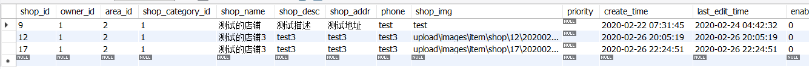
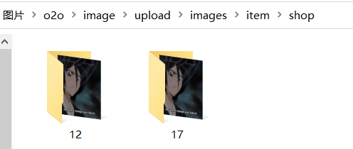
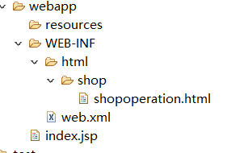
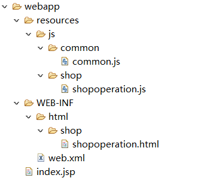
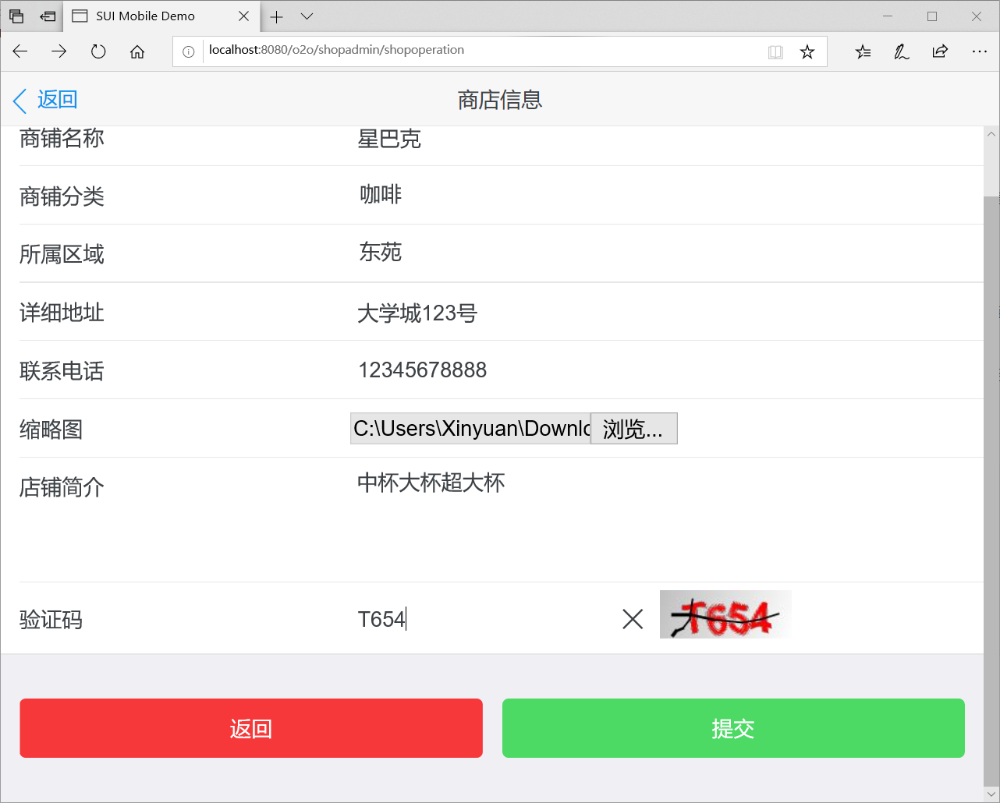
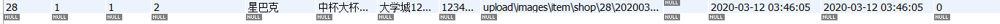
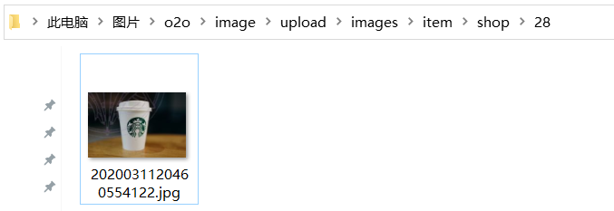

# 店铺注册

进一步熟悉Dao层，Service层和Controller层的编写。

首先是Dao层，下面的方法都是返回变动的记录数目。一般都只执行一条记录，则操作成功返回1，否则为0。

### ShopDao.java

``` java
package com.xinyuan.o2o.dao;
import com.xinyuan.o2o.entity.Shop;

public interface ShopDao {
	int insertShop(Shop shop);
	int updateShop(Shop shop);
}
```

重点是Mapper的写法，下面介绍了insert和update的写法。

### ShopDao.xml

``` java
<?xml version="1.0" encoding="UTF-8"?>
<!DOCTYPE mapper
PUBLIC "-//mybatis.org//DTD Mapper 3.0//EN"
"http://mybatis.org/dtd/mybatis-3-mapper.dtd">
<mapper namespace = "com.xinyuan.o2o.dao.ShopDao">
	<insert id="insertShop" useGeneratedKeys="true" keyColumn="shop_id"
		keyProperty="shopId">
		INSERT INTO
		tb_shop(owner_id, area_id, shop_category_id,
		shop_name, shop_desc, shop_addr,
		phone, shop_img, priority,
		create_time, last_edit_time, enable_status,
		advice)
		VALUES
		(#{owner.userId},#{area.areaId},#{shopCategory.shopCategoryId},#{shopName},
		#{shopDesc},#{shopAddr},#{phone},#{shopImg},#{priority},
		#{createTime},#{lastEditTime}, #{enableStatus},#{advice})
	</insert>
	<update id="updateShop" parameterType="com.xinyuan.o2o.entity.Shop">
		update tb_shop
		<set>
			<if test="shopName != null">shop_name=#{shopName},</if>
			<if test="shopDesc != null">shop_desc=#{shopDesc},</if>
			<if test="shopAddr != null">shop_addr=#{shopAddr},</if>
			<if test="phone != null">phone=#{phone},</if>
			<if test="shopImg != null">shop_img=#{shopImg},</if>
			<if test="priority != null">priority=#{priority},</if>
			<if test="lastEditTime != null">last_edit_time=#{lastEditTime},</if>
			<if test="enableStatus != null">enable_status=#{enableStatus},</if>
			<if test="advice != null">advice=#{advice},</if>
			<if test="area != null">area_id=#{area.areaId},</if>
			<if test="shopCategory != null">shop_category_id=#{shopCategory.shopCategoryId}</if>
		</set>
		where shop_id=#{shopId}
	</update>
</mapper>
```

insert需要设置插入成功后将自增的主键赋值给Shop对象的shopId属性，在插入成功后会调用Shop的setter方法进行赋值。VALUES()语句部分可以直接使用Shop对象的属性，具体通过getter方法获取属性值，组装后插入。

update用到了一些比较有用的标签，如\<set>\</set>和\<if>\</if>。因为更新时不一定更新所有字段，这样写可以自动化添加需要插入的字段（属性值不为null，都是对象）。

至于为什么update要写parameterType而insert不用，其实parameterType只是起标识作用，可写可不写，特别是只有一个参数的时候。

------

实际开发时，在DAO层和Service层之间可能还会有一层DTO。可以理解为DTO是在DAO层返回的Entity对象基础上进行一个封装，供上层的Service或Controller使用。封装后数据会更友好，也更安全。

### ShopExecution.java

``` java
// 结果状态
private int state;
// 状态标识
private String stateInfo;
// 店铺数量
private int count;
// 操作的shop(增删改店铺的时候用到)
private Shop shop;
// shop列表(查询店铺列表的时候使用)
private List<Shop> shopList;

public ShopExecution() {}
// 店铺操作失败的时候使用的构造器
public ShopExecution(ShopStateEnum stateEnum) {
    this.state = stateEnum.getState();
    this.stateInfo = stateEnum.getStateInfo();
}
// 店铺操作成功的时候使用的构造器
public ShopExecution(ShopStateEnum stateEnum, Shop shop) {
    this.state = stateEnum.getState();
    this.stateInfo = stateEnum.getStateInfo();
    this.shop = shop;
}
// 店铺操作成功的时候使用的构造器
public ShopExecution(ShopStateEnum stateEnum, List<Shop> shopList) {
    this.state = stateEnum.getState();
    this.stateInfo = stateEnum.getStateInfo();
    this.shopList = shopList;
}
```

上面是Shop对象对应的DTO层写法，属性包括状态、数量和集合这3部分。除此之外，还有不同操作结果对应的不同构造方法，以及属性的getters&setters方法（未列出）。

另外，这里ShopStateEnum为枚举类型Enum。可以将它理解为一个特殊的类，和类一样有属性、方法，构造方法（一般为private，不对外），静态方法，getter&setter等等。特点是它内部会有一个枚举值（大写）的列表，如：

### ShopStateEnum.java

``` java
CHECK(0, "审核中"), OFFLINE(-1, "非法店铺"), SUCCESS(1, "操作成功"), PASS(2, "通过认证"), INNER_ERROR(-1001,"内部系统错误"), NULL_SHOPID(-1002, "ShopId为空"),NULL_SHOP(-1003, "shop信息为空");
```

在使用的时候也要先创建对象，如ShopStateEnum.CHECK，注意它的类型还是ShopStateEnum，只不过在使用时JVM会使用(0, "审核中")这组参数来调用私有的构造方法，从而获得一个ShopStateEnum的对象。

参考链接：

> http://www.mamicode.com/info-detail-2240108.html
>
> https://blog.csdn.net/wyx0224/article/details/81190792

------

然后是Service层，主要有两部分：接口和接口的实现类。

### ShopService.java

``` java
public interface ShopService {
	ShopExecution addShop(Shop shop, InputStream shopImg, String fileName) throws ShopOperationException;
}

```

接口其实比较简单，就写方法头即可。

### ShopServiceImpl.java

``` java
@Service
public class ShopServiceImpl implements ShopService{
	
	@Autowired
	private ShopDao shopDao;
	
	@Override
	@Transactional
	public ShopExecution addShop(Shop shop, InputStream imgInputStream, String fileName) throws ShopOperationException{
		// 空值判断
		if (shop == null) {
			return new ShopExecution(ShopStateEnum.NULL_SHOP);
		}
		try {
			// 给店铺信息赋初始值
			shop.setEnableStatus(0);
			shop.setCreateTime(new Date());
			shop.setLastEditTime(new Date());
			// 添加店铺信息
			int effectedNum = shopDao.insertShop(shop);
			if (effectedNum <= 0) {
				throw new ShopOperationException("店铺创建失败");
			} else {
				if (imgInputStream != null) {
					// 存储图片
					try {
						// 这里其实写得有问题，因为addShopImg根本不会抛出异常，所以也捕获不到。
						addShopImg(shop, imgInputStream, fileName);
					} catch (Exception e) {
						throw new ShopOperationException("addShopImg error:" + e.getMessage());
					}
					// 更新店铺的图片地址
					effectedNum = shopDao.updateShop(shop);
					if (effectedNum <= 0) {
						throw new ShopOperationException("更新图片地址失败");
					}
				}
			}
		} catch (Exception e) {
			throw new ShopOperationException("addShop error:" + e.getMessage());
		}
		return new ShopExecution(ShopStateEnum.CHECK, shop);
	}

	// 添加（存储到指定目录）并获取shop图片目录的相对值路径
	private void addShopImg(Shop shop, InputStream thumbnail, String fileName) {
		String dest = PathUtil.getShopImagePath(shop.getShopId());
		String shopImgAddr = ImageUtil.generateThumbnail(thumbnail, fileName, dest);
		shop.setShopImg(shopImgAddr);
	}
}

```

在实现类前面添加@Service注解。然后在类内部需要用到DAO层接口的地方添加@Autowired注解。那么为什么DTO层不需要注解而能直接使用呢，是因为DTO层的ShopExecution本身并不是接口而只是一个普通的类，不需要Spring去自动注入实现。

另外，addShop方法前面还有一个@Transactional注解，表明它是事务型的。即如果中途执行错误或抛出异常，则回滚所有操作。这里回滚操作主要是指数据库的操作，也就是DAO层的方法。

这里还封装了一个简单的自定义RuntimeException类：

``` java
package com.xinyuan.o2o.exceptions;

public class ShopOperationException extends RuntimeException{
	// 随机的序列化ID
	private static final long serialVersionUID = 2361446884822298905L;
	public ShopOperationException(String msg) {
		super(msg);
	}
}
```

继承RuntimeException而不是Exception，是因为只有RuntimeException或者它的子类，才能触发回滚。

最后，注意一个可能出现的错误。那就是跑JUnit时需要用到的图片文件应该存储在src/test/resources目录下，而不是src/main/resources目录下，因为src/test/java和src/test/resources的target output folder才是一样的。

如果验证成功后，可以看到数据库和指定目录下都有对应图片信息。





------

接下来是Controller层。

### ShopManagementController.java

``` java
@Controller
@RequestMapping("/shopadmin")
public class ShopManagementController {
	
	@Autowired
	private ShopService shopService;
	
	@RequestMapping(value = "/registershop", method = RequestMethod.POST)
	@ResponseBody
	private Map<String, Object> registerShop(HttpServletRequest request) {
		Map<String, Object> modelMap = new HashMap<String, Object>();
		// 1.接收并转化相应的参数，包括店铺信息以及图片信息
		// shopStr应该是JSON字符串
		String shopStr = HttpServletRequestUtil.getString(request, "shopStr");
		ObjectMapper mapper = new ObjectMapper();
		Shop shop = null;
		try {
			// JSON -> POJO(Java Bean)对象
			shop = mapper.readValue(shopStr, Shop.class);
		} catch (Exception e) {
			modelMap.put("success", false);
			modelMap.put("errMsg", e.getMessage());
			return modelMap;
		}
		CommonsMultipartFile shopImg = null;
		CommonsMultipartResolver commonsMultipartResolver = new CommonsMultipartResolver(
				request.getSession().getServletContext());
		if (commonsMultipartResolver.isMultipart(request)) {
			MultipartHttpServletRequest multipartHttpServletRequest = (MultipartHttpServletRequest) request;
			shopImg = (CommonsMultipartFile) multipartHttpServletRequest.getFile("shopImg");
		} else {
			modelMap.put("success", false);
			modelMap.put("errMsg", "上传图片不能为空");
			return modelMap;
		}
		// 2.注册店铺
		if (shop != null && shopImg != null) {
			PersonInfo owner = new PersonInfo();
			// Session TODO
			owner.setUserId(1L);
			shop.setOwner(owner);
			ShopExecution se;
			try {
				se = shopService.addShop(shop, shopImg.getInputStream(), shopImg.getOriginalFilename());
				if (se.getState() == ShopStateEnum.CHECK.getState()) {
					modelMap.put("success", true);
				} else {
					modelMap.put("success", false);
					modelMap.put("errMsg", se.getStateInfo());
				}
			} catch (ShopOperationException e) {
				modelMap.put("success", false);
				modelMap.put("errMsg", e.getMessage());
			} catch (IOException e) {
				modelMap.put("success", false);
				modelMap.put("errMsg", e.getMessage());
			}
			return modelMap;
		} else {
			modelMap.put("success", false);
			modelMap.put("errMsg", "请输入店铺信息");
			return modelMap;
		}
	}
}
```

需要在控制器前面添加@Controller注解，同时用@RequestMapping("/shopadmin")指定访问该控制器的路由地址。这个地址是基于根地址的，根地址就是项目的名称。所以实际上访问的URL应该是hostname/o2o/shopadmin。但是一般我们访问的是这个控制器里的方法，而不是它本身，所以在方法前面也需要指定路由，这里也指定了访问方法为“POST”。@Response注解表示会将Map对象自动转换为JSON格式的文件返回给浏览器。

另外，registerShop方法的参数为HttpServletRequest对象，这也是接收POST请求的通常写法。因为POST请求会发送一些表单数据，经过转换后变成键值对的形式。可以通过request.getParameter(key)方法获取数据值。key的设定需要和前端进行沟通，统一标准。

后面多数就是一些逻辑了，会调用到Service层的接口，所以也需要@Autowired动态注入。

下面介绍处理GET请求控制器的写法：

### ShopAdminController.java

``` java
@Controller
@RequestMapping(value = "shopadmin", method = { RequestMethod.GET })
public class ShopAdminController {
	@RequestMapping(value = "/shopoperation")
	public String shopOperation() {
		// 转发至店铺注册/编辑页面
		return "shop/shopoperation";
	}
}
```

这里直接在控制器前面设置method，表明类里面的所有方法都是GET，但仍然需要单独为方法设置路由。GET的响应方法一般都比较简单，如果URL里有参数，则方法里也需要包含相应参数。shopOperation方法没有参数，我们设定它直接返回一个静态的.html文件。返回值为String类型，表示的实际上是静态资源的地址。

我们在配置spring的视图解析器时，默认会给静态资源添加前缀和后缀，如果还原的话，实际上是***/WEB-INF/html/***shop/shoperation***.html***。最后强调一点，/WEB-INF/目录下的文件都是无法通过浏览器输入真实的文件路径来访问的，必须通过路由地址访问。前面说的根地址对应于实际目录为/webapp，而/WEB-INF就位于它下面。所以我们直接访问/o2o/index.jsp是可行的，而访问/o2o/WEB-INF/...是不行的，404。

所谓路由，就是把虚拟地址映射到一个实际的文件目录地址。



------

这里额外介绍带参数的DAO层和mapper的写法，在mapper中还用了where限制条件的tag：

``` java
public interface ShopCategoryDao {
	List<ShopCategory> queryShopCategory(@Param("shopCategoryCondition") ShopCategory shopCategoryCondition);
}
```

``` xml
<?xml version="1.0" encoding="UTF-8"?>
<!DOCTYPE mapper
    PUBLIC "-//mybatis.org//DTD Mapper 3.0//EN"
    "http://mybatis.org/dtd/mybatis-3-mapper.dtd">
<mapper namespace="com.xinyuan.o2o.dao.ShopCategoryDao">
	<select id="queryShopCategory" resultType="com.xinyuan.o2o.entity.ShopCategory">
		SELECT
		shop_category_id,
		shop_category_name,
		shop_category_desc,
		shop_category_img,
		priority,
		create_time,
		last_edit_time,
		parent_id
		FROM
		tb_shop_category
		<where>
			<if test="shopCategoryCondition == null">
				and parent_id is null
			</if>
			<if test="shopCategoryCondition != null">
				and parent_id is not null
			</if>
			<if
				test="shopCategoryCondition != null and shopCategoryCondition.parent != null and shopCategoryCondition.parent.shopCategoryId != null">
				and parent_id = #{shopCategoryCondition.parent.shopCategoryId}
			</if>
		</where>
		ORDER BY
		priority DESC
	</select>
</mapper>
```

下面我们介绍前后端协调的问题，因为后端代码（控制层）最终是要和前端代码（js）沟通的。我们看下面的jquery代码片段：

``` javascript
// 生成表单对象，用于接收参数并传递给后台
var formData = new FormData();
// 添加图片流进表单对象里
formData.append('shopImg', shopImg);
// 将shop json对象转成字符流保存至表单对象key为shopStr的的键值对里
formData.append('shopStr', JSON.stringify(shop));
// 获取表单里输入的验证码
var verifyCodeActual = $('#j_captcha').val();
if (!verifyCodeActual) {
    $.toast('请输入验证码！');
    return;
}
formData.append('verifyCodeActual', verifyCodeActual);
```

显然前端将表单数据封装成了一个JSON字符串，然后以键值对的方式append到表单对象，之后再将表单对象post发送给后端。键名shopStr，和前面Controller的HttpServletRequestUtil.getString方法中用到的字符参数是吻合的。

最后是编码过程中遇到的几个问题：

### 前端resources路径问题

在shopoperation.html中引用的js文件路径为：

``` html
<script type='text/javascript' src='../resources/js/common/common.js'
		charset='utf-8'></script>
```

然而实际的工程路径为：



如果按正常理解的话，路径会定位到html目录下，但是为什么这么写是对的呢？因为前面提到过spring-web中的视图解析器会给所有html文件路径添加前后缀，所以实际上../是从/WEB-INF回退到上级目录的，所以也就是webapp目录下，自然我们可以顺着定位到需要的js文件。

### Image Not Found问题

通过控制台输出的log信息，可以定位问题是watermark水印图片的路径有问题。用debug输出了一下原始路径，发现有几处比较严重的错误。

第一个是路径中文件夹带空格，被编码成了%20，所以应该解码回真实的字符；第二个是Windows下的路径问题，分割符是 '\\' 而不是 ‘/'（Windows确实有些奇葩）。

简单在PathUtil中添加了一个方法转换路径：

``` java
public static String convertPath(String basePath) {
    try {
        return URLDecoder.decode(basePath.replace("/", seperator),"utf-8");
    } catch (UnsupportedEncodingException e) {
        e.printStackTrace();
        return "";
    }
}
```

### 修改JS文件但没有应用的问题

试了重启tomcat也没用，和浏览器有关。有些浏览器会继续用旧的缓存js文件，所以修改无法应用。清一下缓存就可以。

最后附上测试结果：







至此，我们大概过了一遍3个层的写法以及和前端间的交互，后面的东西就大同小异了。