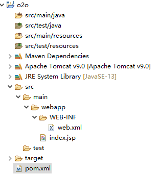
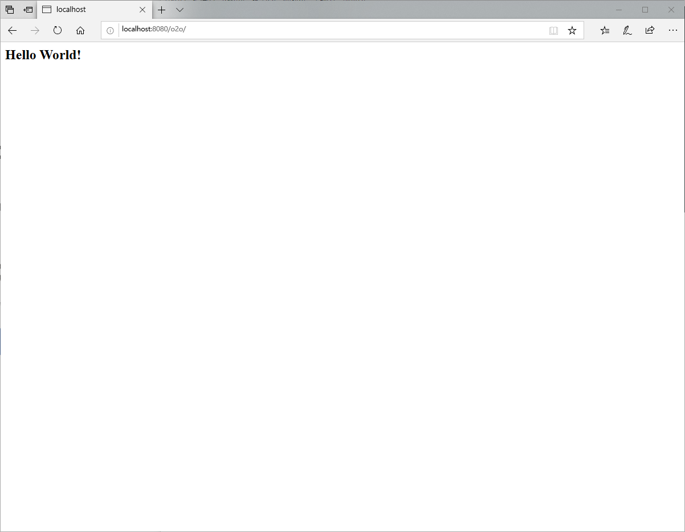

# 环境配置

重要的几个工具：Eclipse，Maven，Tomcat和MySQL

一个基本的Maven Web项目目录如图：



除了配置一些路径外，还需要设置3个常用的文件：pom.xml，web.xml和settings.xml。前两个是Eclipse创建Maven Web项目自动生成的，后一个位于Maven的系统安装目录。

### pom.xml

``` xml
        <plugin>
        	<!-- https://mvnrepository.com/artifact/org.apache.maven.plugins/maven-compiler-plugin -->
		    <groupId>org.apache.maven.plugins</groupId>
		    <artifactId>maven-compiler-plugin</artifactId>
		    <version>3.8.1</version>
		    <configuration>
		    	<source>13</source>
		    	<target>13</target>
		    	<encoding>UTF8</encoding>
		    </configuration>
        </plugin>
```

除了配置dependency依赖外，还可以配置plugin插件。这里配置了一个eclipse的maven项目编译工具。

### web.xml

``` xml
<?xml version="1.0" encoding="UTF-8"?>
<!DOCTYPE html>
<web-app version="4.0" 
    xmlns="http://xmlns.jcp.org/xml/ns/javaee"
    xmlns:xsi="http://www.w3.org/2001/XMLSchema-instance"
    xsi:schemaLocation="http://xmlns.jcp.org/xml/ns/javaee　　　    　 　　
    http://xmlns.jcp.org/xml/ns/javaee/web-app_4_0.xsd">
  <display-name>Archetype Created Web Application</display-name>
  <welcome-file-list>
  	<welcome-file>index.jsp</welcome-file>
  	<welcome-file>index.html</welcome-file>
  </welcome-file-list>
</web-app>
```

需要自行搜索和Dynamic Web Module版本相符的Schema头。welcome-file-list指定入口文件，默认是index.jsp，如果没有顺位往下找，都没有报404。

### settings.xml

``` xml
  <!-- localRepository
   | The path to the local repository maven will use to store artifacts.
   |
   | Default: ${user.home}/.m2/repository
  <localRepository>/path/to/local/repo</localRepository>
  -->
  <mirrors>
    <!-- mirror
     | Specifies a repository mirror site to use instead of a given repository. The repository that
     | this mirror serves has an ID that matches the mirrorOf element of this mirror. IDs are used
     | for inheritance and direct lookup purposes, and must be unique across the set of mirrors.
     |
    <mirror>
      <id>mirrorId</id>
      <mirrorOf>repositoryId</mirrorOf>
      <name>Human Readable Name for this Mirror.</name>
      <url>http://my.repository.com/repo/path</url>
    </mirror>
     -->
     <mirror>
      <id>alimaven</id>
      <name>aliyun maven</name> <url>http://maven.aliyun.com/nexus/content/groups/public/</url>
      <mirrorOf>central</mirrorOf>
     </mirror> 
  </mirrors>
```

需要设置两个东西，localRepository表示maven下载jar包的存放目录，这里按默认的.m2目录就不改了；mirror设置下载的镜像服务器，国内用阿里云会比默认国外的节点更快。

除此之外，还有一些可能遇到的坑，列举如下：

### eclipse没有server tab

没有需要自行安装配置。

> https://blog.csdn.net/Zhuchang1999/article/details/89209003
>
> https://blog.csdn.net/qq_39135287/article/details/82114642

### server运行tomcat报端口错误

原因是tomcat在安装的时候有一个端口没配置（不配置为-1），改端口即可。

> https://www.oschina.net/question/2843307_2267338

### 新建的test source folder目录改路径出错

test需要开启contains test sources

> https://blog.csdn.net/weixin_43370380/article/details/97614831

最后，所有环境配置成功后运行tomcat，可以看到index.jsp内容。




