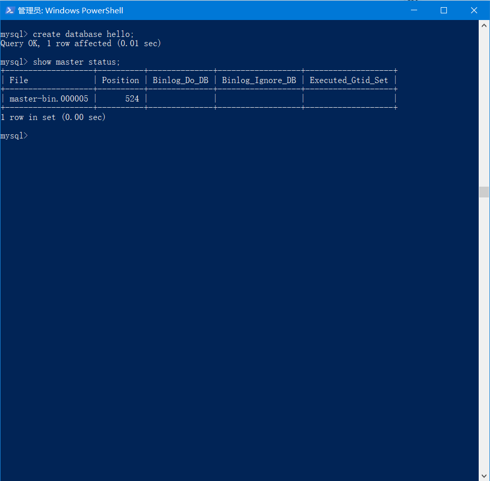
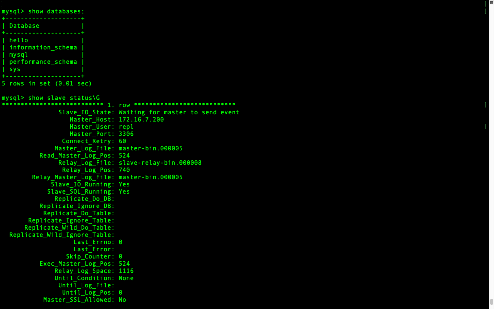
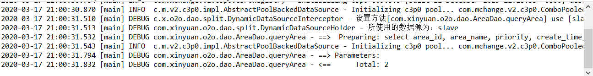
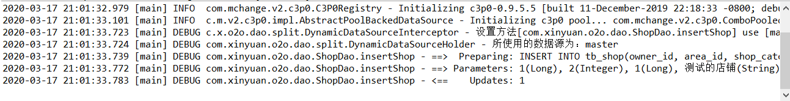

# 读写分离

### 配置

配置这个配到凌晨，心累。而且还是两个巨奇葩的平台，不是Linux。

Master: Win10 ; Slave: Mac OS。

### Win 10

* 配置环境变量：将路径C:\Program Files\MySQL\MySQL Server 8.0\bin添加到系统的Path路径下
* 修改配置文件my.ini https://blog.csdn.net/itmr_liu/article/details/80851266 每次修改前在桌面新建一个空白文档，然后将旧的文件内容复制进去，修改完了再将副本拷贝回该目录。
* 修改成功后，重启MySQL。Win 10没有restart指令，需要先暂停再启动。net start/stop MySQL80。
* master生效后，添加slave作为远程连接用户，并添加权限 https://blog.csdn.net/li_0891/article/details/80915780 如果后续要修改用户和权限，https://www.cnblogs.com/pejsidney/p/8945934.html

### Mac OS

* 配置环境变量：https://www.cnblogs.com/yanlin-10/p/9388911.html
* 修改配置文件，mac版并没有，要自己生成并设置 https://blog.csdn.net/Wjhsmart/article/details/85325538。如果提示没有修改权限的话，指令前面加sudo。
* 修改后重启MySQL，指令 https://www.jianshu.com/p/b0cca588f14d
* 然后开启slave，如果遇到问题就重置slave然后重启MySQL https://www.cnblogs.com/shengdimaya/p/7681550.html

### 其他问题

正常来说按上面的配置应该是没有问题的，但是实际中遇到了两个比较坑的地方：

##### slave 1396错误

我反正是把master和slave里涉及到错误的用户全删了，然后重新在master创建用户和设置权限。https://blog.csdn.net/asty9000/article/details/80945631

##### slave 2061错误

这个是最坑的，明明什么问题都没有，但就是连不上。应该是因为MySQL 8.0默认不准使用明文密码导致的。需要在master里删除并重新创建用户，设置旧版MySQL的密码存储方式 https://blog.csdn.net/wawa8899/article/details/86689618

##### 同步问题

千万记得不要在slave上进行任何写操作，slave的写操作只能从master同步，否则容易产生冲突。另外，如果slave挂了的话，恢复时需要重新设置master_log_pos为最近一次success的位置。（还没遇到过，也不清楚，不知道slave会不会记录位置并自动恢复）

成功后的测试截图，注意到slave读取到的binary_log和master的一样，都是最新的。





现在还有一个问题是，原来master里面有一个数据库o2o，如何把它同步到slave呢？因为主从同步只会同步新的events，也就是说原先master和slave里的所有数据都各自保持独立，不会进行初始化同步。

我们可以将master里的o2o先导出sql，然后drop它。再重新用o2o.sql建立数据库o2o。这里导出我用的是workbench，因为用命令导出的话会有编码问题，出现中文乱码。https://blog.csdn.net/lin1094201572/article/details/79675558

但是slave这边会出现一个无法执行的操作，那就是drop。因为它原先并没有o2o这个数据库。如果不处理的话，它就会一直卡主，无法作出后续的同步。这个时候就需要跳过一些事务，这里的话可以选择跳过事务的ID（比较麻烦）https://www.cnblogs.com/wy123/p/9079397.html或者指定数目的事务https://www.cnblogs.com/feiyun126/p/6945387.html ，因为只需要跳过drop这个事务，所以用后者就行了。

忽略一次错误后，后面的就都可以顺利完成了，o2o数据库也可以完整地转移到slave了。

最后的话呢，给主从库都添加一个'work'@'%'账号，来允许本地的数据库访问。这里由于我的主库也是在本地，所以访问的时候jdbc的url也是localhost，账号和密码修改就行了；从库的话还需要修改jdbc的url，如下图：

``` 
jdbc.driver = com.mysql.cj.jdbc.Driver
jdbc.url = jdbc:mysql://172.16.7.196:3306/o2o?useUnicode=true&characterEncoding=utf8&serverTimezone=UTC
jdbc.username=work
jdbc.password=230230
```

那么，最后我们的目标也很明确了，就是**写的时候用主库，读的时候用从库**，主从分离，读写分离。

------

接下来我们从代码层面去进行读写分离的配置，项目中涉及到数据库配置的部分主要有3处，自底向上分别是底层驱动jdbc.properties，spring框架中负责dao层的spring-dao.xml以及负责mapper转换成SQL语句的mybatis-config.xml。

首先看jdbc，这里只要引入不同数据源的url就行了：

``` 
jdbc.driver = com.mysql.cj.jdbc.Driver
jdbc.master.url = jdbc:mysql://localhost:3306/o2o?useUnicode=true&characterEncoding=utf8&serverTimezone=UTC
jdbc.slave.url = jdbc:mysql://172.16.7.196:3306/o2o?useUnicode=true&characterEncoding=utf8&serverTimezone=UTC
jdbc.username=work
jdbc.password=230230
```

然后是spring-dao.xml，这里的话用主要是告诉spring有哪些数据源（如master和slave），然后如何动态去获取数据源，以及惰性加载的机制（就是说在运行的时候才决定动态获取）。

``` xml
<!-- 2.数据库连接池 -->
<bean id="abstractDataSource" abstract="true"
      class="com.mchange.v2.c3p0.ComboPooledDataSource" destroy-method="close">
    <!-- c3p0连接池的私有属性 -->
    <property name="maxPoolSize" value="30" />
    <property name="minPoolSize" value="10" />
    <property name="initialPoolSize" value="10"/> 
    <!-- 关闭连接后不自动commit -->
    <property name="autoCommitOnClose" value="false" />
    <!-- 获取连接超时时间 -->
    <property name="checkoutTimeout" value="10000" />
    <!-- 当获取连接失败重试次数 -->
    <property name="acquireRetryAttempts" value="2" />
</bean>
<bean id="master" parent="abstractDataSource">
    <!-- 配置连接池属性 -->
    <property name="driverClass" value="${jdbc.driver}" />
    <property name="jdbcUrl" value="${jdbc.master.url}" />
    <property name="user" value="${jdbc.username}" />
    <property name="password" value="${jdbc.password}" />
</bean>
<bean id="slave" parent="abstractDataSource">
    <!-- 配置连接池属性 -->
    <property name="driverClass" value="${jdbc.driver}" />
    <property name="jdbcUrl" value="${jdbc.slave.url}" />
    <property name="user" value="${jdbc.username}" />
    <property name="password" value="${jdbc.password}" />
</bean>
<!-- 配置动态数据源，这儿targetDataSources就是路由数据源所对应的名称 -->
<bean id="dynamicDataSource" class="com.xinyuan.o2o.dao.split.DynamicDataSource">
    <property name="targetDataSources">
        <map>
            <entry value-ref="master" key="master"></entry>
            <entry value-ref="slave" key="slave"></entry>
        </map>
    </property>
</bean>
<bean id="dataSource"
      class="org.springframework.jdbc.datasource.LazyConnectionDataSourceProxy">
    <property name="targetDataSource">
        <ref bean="dynamicDataSource" />
    </property>
</bean>
```

最后是mybatis-config.xml。这里主要就是一个拦截器，拦截的是mapper转换成的SQL语句。

``` xml
<plugins>
    <plugin interceptor="com.xinyuan.o2o.dao.split.DynamicDataSourceInterceptor">
    </plugin>
</plugins>
```

涉及到的java代码有：

``` java
public class DynamicDataSource extends AbstractRoutingDataSource{
	@Override
	protected Object determineCurrentLookupKey() {
		return DynamicDataSourceHolder.getDbType();
	}
}

public class DynamicDataSourceHolder {
	private static Logger logger = LoggerFactory.getLogger(DynamicDataSourceHolder.class);
	private static ThreadLocal<String> contextHolder = new ThreadLocal<String>();
	public static final String DB_MASTER = "master";
	public static final String DB_SLAVE = "slave";

	public static String getDbType() {
		String db = contextHolder.get();
		if (db == null) {
			db = DB_MASTER;
		}
		return db;
	}

	/**
	 * 设置线程的dbType
	 * 
	 * @param str
	 */
	public static void setDbType(String str) {
		logger.debug("所使用的数据源为：" + str);
		contextHolder.set(str);
	}

	/**
	 * 清理连接类型
	 */
	public static void clearDBType() {
		contextHolder.remove();
	}
}

@Intercepts({ @Signature(type = Executor.class, method = "update", args = { MappedStatement.class, Object.class }),
	@Signature(type = Executor.class, method = "query", args = { MappedStatement.class, Object.class,
			RowBounds.class, ResultHandler.class }) })
public class DynamicDataSourceInterceptor implements Interceptor {
	private static Logger logger = LoggerFactory.getLogger(DynamicDataSourceInterceptor.class);
	private static final String REGEX = ".*insert\\u0020.*|.*delete\\u0020.*|.*update\\u0020.*";

	@Override
	public Object intercept(Invocation invocation) throws Throwable {
		boolean synchronizationActive = TransactionSynchronizationManager.isActualTransactionActive();
		Object[] objects = invocation.getArgs();
		MappedStatement ms = (MappedStatement) objects[0];
		String lookupKey = DynamicDataSourceHolder.DB_MASTER;
		if (synchronizationActive != true) {
			// 读方法
			if (ms.getSqlCommandType().equals(SqlCommandType.SELECT)) {
				// selectKey 为自增id查询主键(SELECT LAST_INSERT_ID())方法，使用主库
				if (ms.getId().contains(SelectKeyGenerator.SELECT_KEY_SUFFIX)) {
					lookupKey = DynamicDataSourceHolder.DB_MASTER;
				} else {
					BoundSql boundSql = ms.getSqlSource().getBoundSql(objects[1]);
					String sql = boundSql.getSql().toLowerCase(Locale.CHINA).replaceAll("[\\t\\n\\r]", " ");
					if (sql.matches(REGEX)) {
						lookupKey = DynamicDataSourceHolder.DB_MASTER;
					} else {
						lookupKey = DynamicDataSourceHolder.DB_SLAVE;
					}
				}
			}
		} else {
			lookupKey = DynamicDataSourceHolder.DB_MASTER;
		}
		logger.debug("设置方法[{}] use [{}] Strategy, SqlCommanType [{}]..", ms.getId(), lookupKey,
				ms.getSqlCommandType().name());
		DynamicDataSourceHolder.setDbType(lookupKey);
		return invocation.proceed();
	}

	@Override
	public Object plugin(Object target) {
		if (target instanceof Executor) {
			return Plugin.wrap(target, this);
		} else {
			return target;
		}
	}

	@Override
	public void setProperties(Properties arg0) {
		// TODO Auto-generated method stub
	}
}
```

简单来说，就是DynamicDataSource调用DynamicDataSourceHolder的getter，获取数据源；DynamicDataSourceInterceptor调用DynamicDataSourceHolder的setter，修改数据源。修改的时候根据SQL语句，做一个简单的正则匹配，如果是insert/update/delete，就用master；如果是select，就用slave。

最后记得给拦截器添加@Intercepts注解，告诉拦截器拦截什么类和什么方法。

为了验证是否成功进行了动态数据源设置，我们可以跑两个DAO的JUnit Test，一个为select，另一个为insert，看看结果如何。





结果符合我们的预期，即select为slave，insert为master。

------

至此，简单的读写分离就到这里结束了。实际运行中，由于读的请求量要远大于写的请求量，所以只设置一个slave作为读的服务器显然是不行的，要设置多个slave，从而达到负载均衡的目的。

此外，我们还可以进一步做以下的一些拓展：

* 阅读Spring部分关于DataSource的源码。
* 通过使用DBProxy中间件，就不需要自己去写代码动态配置数据源了，甚至于我们连接的是这个中间件的服务器，而不是数据库本身。（感觉类似于一个代理服务器，通过API来调用方法并获取结果）


